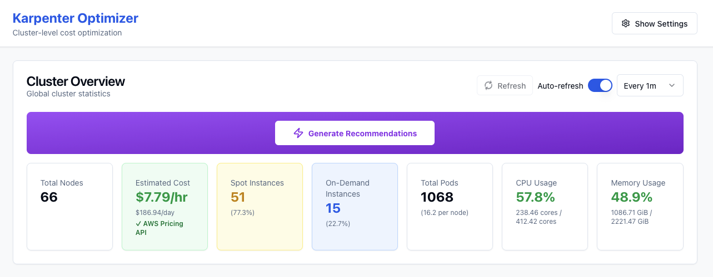
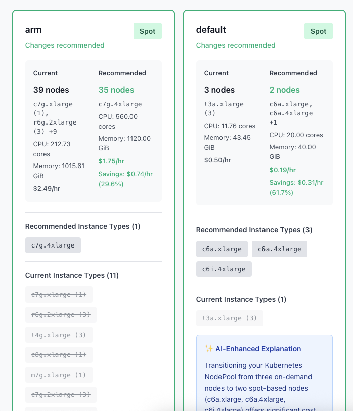
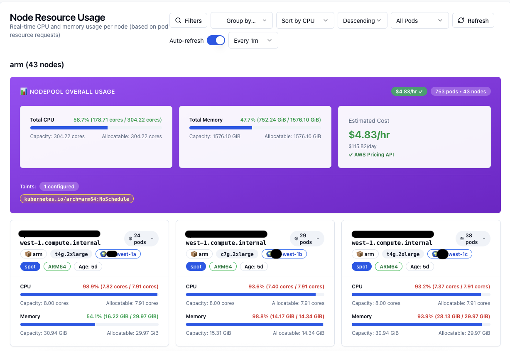
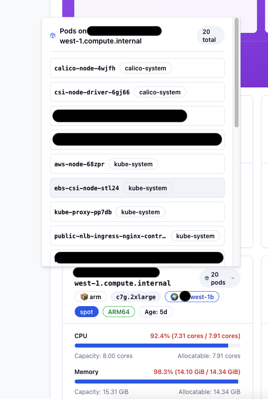
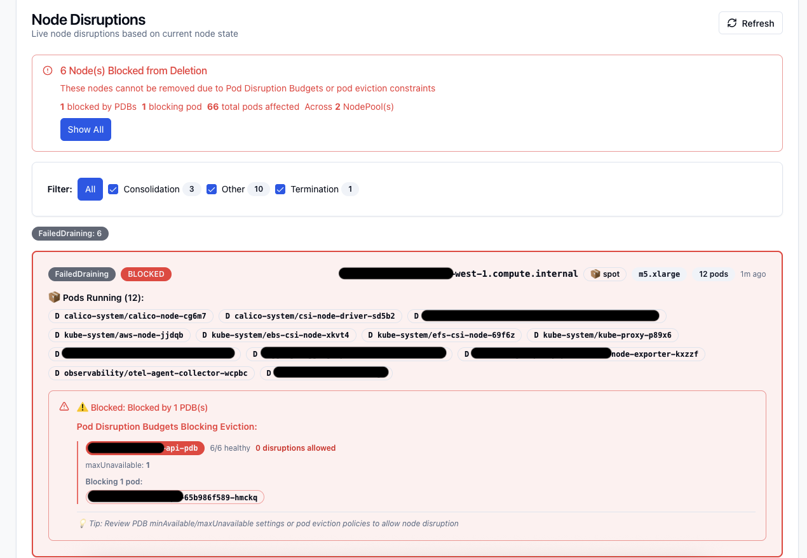
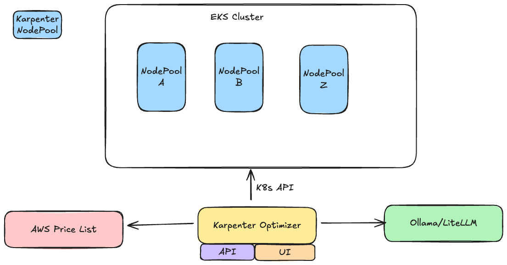

# Karpenter Optimizer

[](LICENSE)
[](https://goreportcard.com/report/github.com/kaskol10/karpenter-optimizer)
[](https://github.com/kaskol10/karpenter-optimizer/actions)
[](https://github.com/kaskol10/karpenter-optimizer/releases)

💰 **Cost optimization tool for Karpenter NodePools**. Analyzes Kubernetes cluster usage and provides AI-powered recommendations to reduce AWS EC2 costs while maintaining performance.

Karpenter Optimizer helps you optimize your Karpenter NodePool configurations by analyzing actual cluster usage and providing intelligent, cost-effective instance type recommendations. Get visual before/after comparisons showing cost and resource savings.

## ✨ Features

- 🎯 **Automatic Workload Discovery**: Automatically fetch workloads from your Kubernetes cluster
- 📊 **Real-time Node Usage**: Visualize actual CPU and memory usage per node with interactive charts
- 🏗️ **NodePool Analysis**: Analyze existing Karpenter NodePool configurations for accurate before/after comparisons
- 💡 **AI-Powered Recommendations**: Get intelligent NodePool recommendations optimized for cost and performance using Ollama/LiteLLM/VLLM
- 💰 **AWS Pricing Integration**: Real-time pricing from AWS Pricing API for accurate cost calculations
- 🔄 **Spot vs On-Demand Optimization**: Automatically recommends optimal capacity types (spot/on-demand)
- 📈 **Cost Savings Analysis**: Detailed cost breakdown showing potential savings per NodePool and cluster-wide
- 🖥️ **Modern Web UI**: React-based interface with real-time updates and progress tracking
- 🚨 **Disruption Tracking**: Monitor Karpenter node disruptions and identify blocked deletions
- 📦 **Helm Chart**: Production-ready Helm chart for easy Kubernetes deployment
- ⚡ **Kubernetes Native**: Uses Kubernetes API directly - no Prometheus required

## 📸 Screenshots

### Cluster Overview


*View cluster-wide statistics and generate recommendations*

### NodePool Recommendations


*Detailed NodePool recommendations with before/after comparisons and cost savings*

### Node Usage Visualization


*Real-time visualization of CPU and memory usage per node with filtering capabilities*

### Pod Location Tracking


*Track pods in nodes with detailed resource usage and filtering by node name or pod name*

### Node Disruption Tracking


*Monitor Karpenter node disruptions and identify blocked deletions with PDB visibility*

## Architecture



Karpenter Optimizer follows a modern microservices architecture:

- **Backend**: Go-based REST API server with Kubernetes integration
- **Frontend**: React web application with interactive charts and visualizations

For detailed architecture documentation, see [docs/architecture.md](docs/architecture.md).

## 🗺️ Roadmap

We're actively working on improving Karpenter Optimizer. Here's what's coming next:

- Multi-cluster Support - Manage and compare recommendations across multiple Kubernetes clusters
- Enchanced filtering - Filter recommendations by cost savings, instance types and capacity types
- Export Recommendations - Export recommendations as YAML manifests for easy application
- Performance Improvements - Optimize API response times for large clusters
- Historical Cost Tracking - Track cost trends over time and measure actual savings
- Machine Learning Predictions - ML-based workload prediction and proactive optimization
- Cost Allocation - Show costs by namespace, team, or label for better chargeback
- Scheduled Recommendations - Automated daily/weekly optimization reports via email or Slack, Discord...
- Policy Engine - Define optimization policies and constraints (e.g., never use spot for production)

### Community-Driven

We welcome community input! If you have ideas or feature requests, please:
- Open an issue on [GitHub](https://github.com/kaskol10/karpenter-optimizer/issues)
- Join our [Discussions](https://github.com/kaskol10/karpenter-optimizer/discussions)
- Contribute via pull requests

## 🚀 Quick Start

### Prerequisites

- Kubernetes cluster with Karpenter installed
- kubectl configured with cluster access
- (Optional) Ollama instance for AI-powered explanations
- (Optional) IRSA (IAM Roles for Service Accounts) configured for EKS clusters (recommended)

## Quick Install

### Using Helm (Recommended)

```bash
helm repo add karpenter-optimizer https://kaskol10.github.io/karpenter-optimizer
helm repo update
helm install karpenter-optimizer karpenter-optimizer/karpenter-optimizer \
  --namespace karpenter-optimizer \
  --create-namespace
```

See the [Helm chart documentation](charts/karpenter-optimizer/README.md) for detailed configuration options.

### Using Docker

```bash
docker run -d \
  --name karpenter-optimizer \
  -p 8080:8080 \
  -v ~/.kube/config:/root/.kube/config:ro \
  ghcr.io/kaskol10/karpenter-optimizer:latest
```

### Local Development

**Backend:**

```bash
# Install dependencies
go mod download

# Run the API server
go run ./cmd/api
```

**Frontend:**

```bash
cd frontend
npm install
npm start
```

The API will be available at `http://localhost:8080` and the frontend at `http://localhost:3000`

**Environment Variables:**
- `KUBECONFIG`: Path to kubeconfig file (default: `~/.kube/config`)
- `KUBE_CONTEXT`: Kubernetes context to use (optional)
- `PORT`: Port for the API server (default: 8080)
- `OLLAMA_URL`: URL to Ollama instance for AI explanations (optional)
- `OLLAMA_MODEL`: Ollama model to use (default: `granite4:latest`)

## 📖 Documentation

- [Quick Start Guide](QUICKSTART.md) - Get started in minutes
- [Deployment Guide](docs/deployment.md) - Detailed deployment instructions
- [IRSA Setup Guide](docs/irsa-setup.md) - Configure IAM Roles for Service Accounts (EKS)
- [Architecture Documentation](docs/architecture.md) - System architecture details
- [API Reference](docs/api-reference.md) - Complete API documentation
- [Contributing Guide](CONTRIBUTING.md) - How to contribute
- [Security Policy](SECURITY.md) - Security reporting
- [Adopters](ADOPTERS.md) - Organizations using Karpenter Optimizer
- [Helm Chart Docs](charts/karpenter-optimizer/README.md) - Helm installation guide

### Example Workload JSON

```json
[
  {
    "name": "web-app",
    "namespace": "default",
    "cpu": "500m",
    "memory": "512Mi",
    "gpu": 0,
    "labels": {}
  },
  {
    "name": "ml-training",
    "namespace": "ml",
    "cpu": "4",
    "memory": "16Gi",
    "gpu": 1,
    "labels": {
      "karpenter.sh/capacity-type": "on-demand"
    }
  }
]
```

## API Endpoints

### Interactive API Documentation

**Swagger UI**: Access interactive API documentation at `/swagger/index.html`.

**Local Development:**
```bash
# Start the API server
go run ./cmd/api

# Access Swagger UI at:
# http://localhost:8080/api/swagger/index.html
```

**Via Ingress (Production):**
When deployed with ingress enabled:
- **Frontend**: `https://your-ingress-host/` (root path)
- **Backend API**: `https://your-ingress-host/api/*` (all API endpoints)
- **Swagger UI**: `https://your-ingress-host/api/swagger/index.html`

The ingress routes:
- `/` → Frontend container (port 80)
- `/api/*` → Backend container (port 8080)

**Dynamic Host Detection:**
Swagger automatically detects the request host and scheme (http/https) from ingress headers (`X-Forwarded-Host`, `X-Forwarded-Proto`), so API calls from Swagger UI will work correctly whether accessed directly or through ingress.

### Generate Swagger Documentation

```bash
# Generate Swagger docs (requires swag CLI: go install github.com/swaggo/swag/cmd/swag@latest)
make swagger
```

### Core Endpoints

- `GET /api/v1/health` - Health check endpoint
- `GET /api/v1/config` - Get API configuration
- `POST /api/v1/analyze` - Analyze workloads and get recommendations
- `GET /api/v1/recommendations` - Get NodePool recommendations based on cluster usage
- `POST /api/v1/recommendations` - Generate recommendations (alias for GET)
- `GET /api/v1/recommendations/cluster-summary` - Get recommendations with AI explanations
- `GET /api/v1/recommendations/cluster-summary/stream` - Get recommendations with SSE progress updates
- `GET /api/v1/namespaces` - List all Kubernetes namespaces
- `GET /api/v1/workloads?namespace=<namespace>` - List workloads in a namespace
- `GET /api/v1/workloads/:namespace/:name` - Get specific workload details
- `GET /api/v1/nodepools` - List all Karpenter NodePools
- `GET /api/v1/nodepools/:name` - Get specific NodePool details
- `GET /api/v1/nodepools/recommendations` - Get NodePool recommendations
- `GET /api/v1/nodes` - Get nodes with usage data
- `GET /api/v1/cluster/summary` - Get cluster-wide statistics
- `GET /api/v1/disruptions` - Get node disruption information
- `GET /api/v1/disruptions/recent` - Get recent node deletions

For complete API documentation with request/response schemas, see the [Swagger UI](http://localhost:8080/swagger/index.html) or generate the docs with `make swagger`.


## Recommendation Output

Each recommendation includes:

- **Name**: Nodepool name
- **Instance Types**: Recommended EC2 instance types
- **Capacity Type**: Spot or on-demand
- **Architecture**: amd64 or arm64
- **Size Range**: Min and max node count
- **Resource Requirements**: CPU and memory ranges based on actual pod resource requests
- **Estimated Cost**: Hourly cost estimate
- **Current State**: Actual NodePool configuration (if found in cluster)
- **Reasoning**: Explanation of the recommendation
- **Matched Workloads**: Workloads that match this nodepool

## Visual Comparison Features

The frontend provides comprehensive before/after comparisons:

- **Cost Comparison**: Current vs recommended costs with savings percentage
- **Node Comparison**: Current vs recommended node counts with reduction metrics
- **Annual Savings**: Projected annual cost savings
- **Per-Nodepool Breakdown**: Detailed charts showing cost and node differences for each nodepool
- **Interactive Charts**: Bar charts and visualizations using Recharts

## Kubernetes Native Approach

Karpenter Optimizer uses the Kubernetes API directly to analyze your cluster:

1. **Node Usage Calculation**: Calculates CPU and memory usage from scheduled pods
2. **Real-time Data**: Uses current cluster state - no external metrics required
3. **Accurate Recommendations**: Bases recommendations on actual resource allocations and node capacity

### How It Works

- Reads pod resource requests directly from Kubernetes API
- Calculates node usage by summing pod requests on each node
- Analyzes NodePool configurations and actual node instances
- Provides recommendations based on actual capacity vs usage

## Kubernetes Integration


### NodePool Analysis

The tool fetches existing Karpenter NodePool configurations:

- **Automatic Discovery**: Lists all NodePools in your cluster
- **Configuration Parsing**: Extracts instance types, capacity types, limits, and requirements
- **Before/After Comparison**: Uses actual NodePool configs as the "before" state
- **Cost Calculation**: Estimates costs based on actual instance types

## Development

### Project Structure

```
.
├── cmd/
│   ├── api/            # Backend API server
│   │   └── main.go
│   └── cli/            # CLI tool
│       └── main.go
├── internal/
│   ├── api/            # HTTP handlers
│   ├── config/         # Configuration
│   ├── kubernetes/     # Kubernetes client
│   └── recommender/    # Recommendation logic
├── frontend/           # React frontend
│   ├── src/
│   │   ├── components/
│   │   │   ├── ComparisonView.js
│   │   │   ├── RecommendationCard.js
│   │   │   ├── WorkloadForm.js
│   │   │   └── WorkloadSelector.js
│   │   └── App.js
│   └── package.json
├── examples/           # Example files
│   └── workloads.json
└── go.mod
```

### Building

```bash
# Build backend
go build -o bin/karpenter-optimizer-api ./cmd/api

# Build CLI
go build -o bin/karpenter-optimizer ./cmd/cli

# Build frontend
cd frontend
npm run build
```

### Docker Deployment

```bash
# Build and run with docker-compose
docker-compose up --build

# Or build individually
docker build -t karpenter-optimizer-api .
docker build -t karpenter-optimizer-frontend ./frontend
```

## Usage Examples

### Example 1: Analyze Workloads from Cluster

1. Start the backend with Kubernetes access:
   ```bash
   KUBECONFIG=~/.kube/config go run ./cmd/api
   ```

2. Open the frontend at `http://localhost:3000`

3. Select a namespace from the dropdown

4. Check workloads to add them

5. Click "Analyze Workloads" to get recommendations

### Example 2: Analyze Cluster Usage

1. Start backend with Kubernetes access:
   ```bash
   KUBECONFIG=~/.kube/config go run ./cmd/api
   ```

2. The recommendations automatically analyze actual pod resource requests and node usage

3. View the comparison charts showing current vs recommended costs

### Example 3: Compare with Existing NodePools

1. Ensure Kubernetes access is configured
2. The tool automatically fetches existing NodePool configurations
3. Recommendations show "before" (actual NodePools) vs "after" (recommended)
4. View detailed cost and node count comparisons

## 🏗️ Architecture


Karpenter Optimizer is built with a modern microservices architecture:

- **Backend**: Go-based REST API server with Kubernetes integration
- **Frontend**: React web application with interactive charts and visualizations
- **CLI**: Go CLI tool for command-line usage and CI/CD integration
- **Helm Chart**: Production-ready Kubernetes deployment

For detailed architecture documentation, see [docs/architecture.md](docs/architecture.md).

## 🔌 API Endpoints

### Core Endpoints

- `GET /api/v1/health` - Health check
- `GET /api/v1/cluster/summary` - Cluster-wide statistics
- `GET /api/v1/nodepools` - List all NodePools
- `GET /api/v1/nodepools/recommendations` - Get NodePool recommendations
- `GET /api/v1/recommendations/cluster-summary` - Get cluster-wide recommendations with AI explanations
- `GET /api/v1/nodes` - List nodes with usage data
- `GET /api/v1/disruptions` - Get node disruption information

See the [Swagger UI](http://localhost:8080/swagger/index.html) for complete interactive API documentation with request/response schemas, or generate the docs with `make swagger`.


## 🤝 Contributing

We welcome contributions! Please see our [Contributing Guide](CONTRIBUTING.md) for details.

- 🐛 [Report a Bug](https://github.com/kaskol10/karpenter-optimizer/issues/new?template=bug_report.md)
- 💡 [Request a Feature](https://github.com/kaskol10/karpenter-optimizer/issues/new?template=feature_request.md)
- 💬 [Join Discussions](https://github.com/kaskol10/karpenter-optimizer/discussions)
- 📝 [Submit a Pull Request](https://github.com/kaskol10/karpenter-optimizer/compare)

## 🌟 Adopters

See [ADOPTERS.md](ADOPTERS.md) for a list of organizations using Karpenter Optimizer. If you're using it, please add your organization via pull request!

## 📄 License

This project is licensed under the Apache License 2.0 - see the [LICENSE](LICENSE) file for details.

## 🔒 Security

For security vulnerabilities, please see [SECURITY.md](SECURITY.md).

## 🙏 Acknowledgments

Karpenter Optimizer is heavily influenced by [eks-node-viewer](https://github.com/awslabs/eks-node-viewer), a fantastic tool by AWS Labs that I've been using for years. This project builds on that foundation and adds improvements I needed for my Karpenter workflows:

1. **Easy visualization** - Modern React web UI vs CLI-only
2. **Track pods in nodes** - Detailed pod-to-node mapping with resource usage
3. **Clarify node disruptions** - Shows why nodes are blocked (PDBs, constraints)
4. **Focus on Karpenter** - Built specifically for Karpenter NodePools
5. **Current cost opportunities** - AI-powered recommendations with actual savings

---

**Made with ❤️ for the Kubernetes community**
